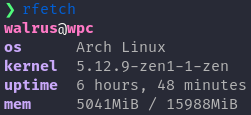

# rFetch - minimal system info fetcher

A small performant system fetcher displaying only a small set of information about your system.

## Install
1. `git clone https://github.com/mWalrus/rfetch.git`
2. `cd rfetch`
3. `sudo make all`
