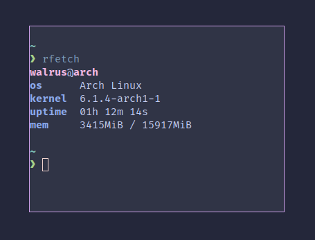

# rFetch - minimal system info fetcher

rFetch is similar to neofetch but without the numerous options and distro specific artworks and it is written in Rust ;). 
rFetch is less than 200 lines, only displays what you need and runs in about 18ms currently. 
Currently supports Linux and Windows.

## Install
Make sure to have cargo make installed (`cargo install --force cargo-make`)
1. `git clone https://github.com/mWalrus/rfetch.git`
2. `cd rfetch`
3. `cargo make install`

Performance improvements will come :). 
Also, any suggestions are welcome!
